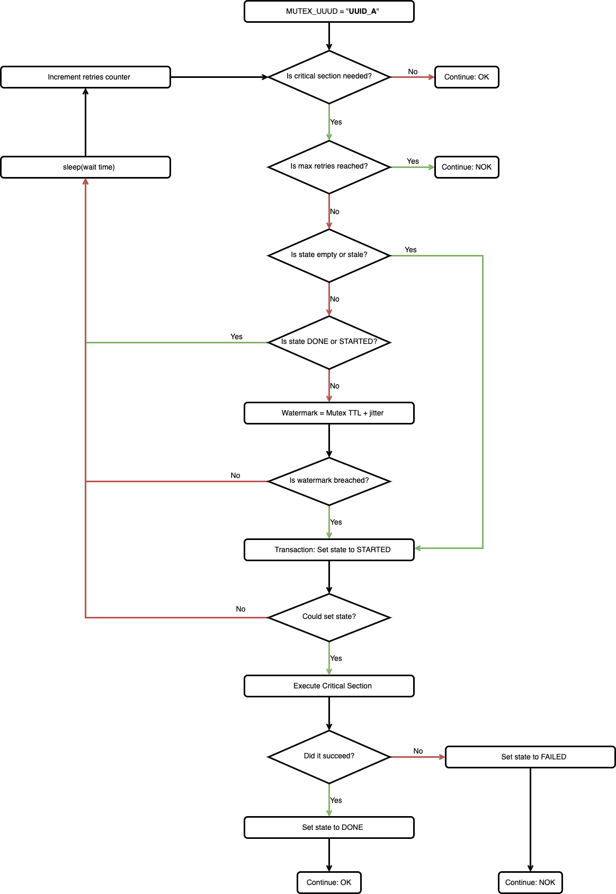

# Distributed mutex design

The simplified logic on the [Cloud Spanner](https://cloud.google.com/spanner) based [mutex](https://en.wikipedia.org/wiki/Mutual_exclusion) or [critical section](https://en.wikipedia.org/wiki/Critical_section) is as follows:
* Determine if the mutex is needed.
* Try to acquire the mutex by marking itself as owner in Cloud Spanner.
* If mutex is acquired, execute the critical section.
* Mark the critical section as executed.

## State machine diagram

Below you have the state machine, still simplified, from the description above.
The logic should keep retrying until either it acquires the mutex and executes it itself or someone else does it.

## More details

The flow chart below has more implementation details and is closer to the code.
There you see a couple of contingencies as:
* Maximum number of retries
* A given time threshold to state that a given mutex entry can be deemed stale (more on that below)
* Another time threshold called watermark to established that if someone else tried and "abandoned it"

## Source for diagrams

The diagrams were produced using [Draw.io](https://app.diagrams.net/) and can be found [here](doc/design/critical_section_diagrams.drawio).

## Why so many contingencies?

There are many error or edge case conditions that can show up in a distributed scenario, so we have to cover them.

### No critical section is needed

For instance, if you are using the mutex to evolve the database schema but currently there no updates.
This is also true for other dynamically determined mutex needs, like uploading files that might or might not be given.
For these reasons we need the very first decision point: ``Is critical section needed?``.

### Cannot acquire mutex or execute it

Assume there is a faulty critical section code.
In this case you should not be caught in a never ending loop of trial and failure, you should abandon and report failure.
Another possibility is that there was an intermittent failure executing the critical section.
Here too you should retry, but not forever.

### Tricky retry on the state

You might be asking why do I have to retry if the state is ``DONE`` on the third ``if``.
The reason for that is that you should go again and validate that the critical section was indeed finished (in the first ``if``) before giving up.
The case for ``STARTED`` is more obvious, someone else got the mutex and is working on it.

### What about the ``watermark``?

This is for the case that someone else started to work on the critical section and either:
* Crashed during the process (the instance was killed or lost connectivity, etc.).
* _Forgot_ to mark as ``DONE``, it finished but broke down before releasing the mutex.
* Is taking too much time to complete the critical section and the ``watermark`` established the time window within which it should finish.

In those cases the ``watermark`` will let someone else take over and retry.
The ``jitter``, if you noticed, is just a good practice to avoid too much of a race condition.

### Why do I have to check if I got the mutex, isn't it the whole point?

Yes it is, but imagine that multiple clients reached this point before Spanner got to commit the first request.
In this case the first to acquire the mutex will _fail_ all other transactions.
This is the race condition that Spanner is here to prevent.

Yes, there is an edge case that is discussed at length in [correctness disclaimer](./code/CORRECTNESS_DISCLAIMER.md).
Please refer to it for further information.
