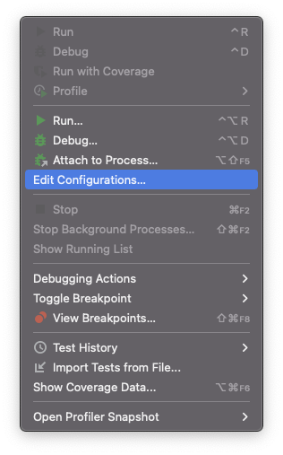
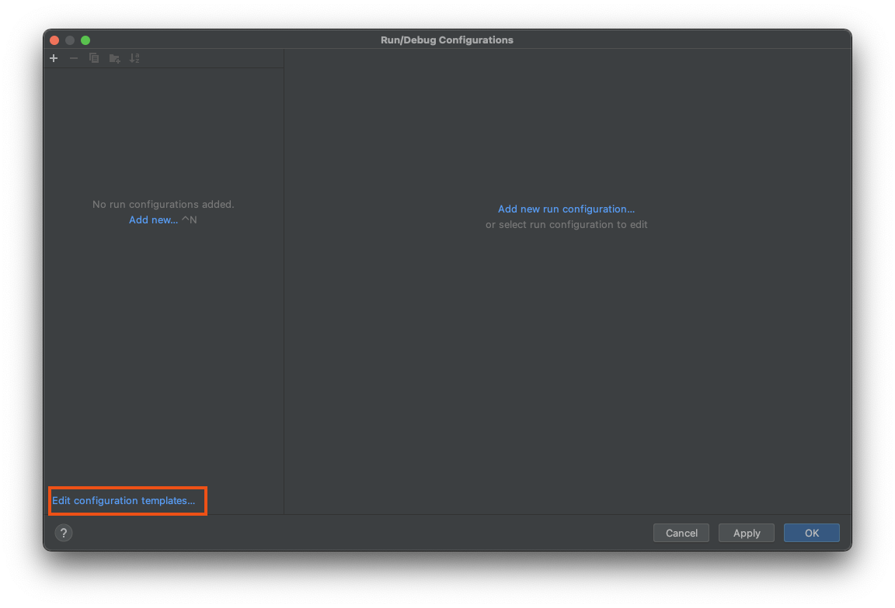

# Development

Below how to bootstrap your python environment, so it is sandboxed.

**NOTE:** Execute the below instructions inside the ``code`` dir:

```bash
cd code
```

## Development Environment Using Pyenv and Virtualenv

Install:

* (optional) [pyenv](https://github.com/pyenv/pyenv)
* [virtualenv](https://virtualenv.pypa.io/en/latest/)
* [poetry](https://python-poetry.org/)
* [jq](https://stedolan.github.io/jq/)
* [pre-commit](https://pre-commit.com/)
* [terraform](https://www.terraform.io/)
* [TFLint](https://github.com/terraform-linters/tflint)
* [tfsec](https://github.com/aquasecurity/tfsec)
* [terraform-docs](https://github.com/terraform-docs/terraform-docs)
* [checkov](https://www.checkov.io/)
* [hadolint](https://github.com/hadolint/hadolint)

### macOS

<details>
<summary>Click me</summary>

You need `Xcode`:

```bash
xcode-select --install
```

And add ``/usr/local/bin`` to your ``PATH`` env var (add to your ``.bashrc`` or ``.zshrc``):

```bash
export PATH=${PATH}:/usr/local/bin
```

</details>

### (Optional) Pyenv

<details>
<summary>Click me</summary>

For macOS follow [https://gist.github.com/eliangcs/43a51f5c95dd9b848ddc](https://gist.github.com/eliangcs/43a51f5c95dd9b848ddc).
You might also need [https://github.com/jiansoung/issues-list/issues/13#issuecomment-478575934](https://github.com/jiansoung/issues-list/issues/13#issuecomment-478575934).

Set python 3.11 as default:

```basn
pyenv install 3.11.5
```

Set pyenv defaults:
```bash
pyenv global 3.11.5
pyenv local 3.11.5
```

</details>

Install packages:

```bash
pip3 install -U pip wheel setuptools poetry pre-commit checkov
```

Add poetry plugins:

### [Bump version](https://github.com/monim67/poetry-bumpversion)


```bash
poetry self add poetry-bumpversion
```

Bumping vresion:

```bash
pushd ./code
poetry version patch
poetry install
poetry version --no-ansi | read CORE_NAME CORE_VERSION
popd

echo "New version of '${CORE_NAME}' = '${CORE_VERSION}'"
```

## Install ``pre-commit`` (only once)

<details>
<summary>Click me</summary>

```bash
pre-commit install
```

### ``pre-commit`` Basics

Check all files:

```bash
pre-commit run --all-files
```

Only check ``code``:

```bash
git ls-files -- code | xargs pre-commit run --files
```

Only check ``terraform``:

```bash
git ls-files -- terraform | xargs pre-commit run --files
```

</details>

## Poetry Basics

<details>
<summary>Click me</summary>

On ``code``:

Install dependencies:

```bash
poetry install
```

Run tests:

```bash
poetry run pytest
```

Run linter:

```bash
poetry run pylint src tests
```

Run formatter:

```bash
poetry run black src tests
```

Build wheel file:

```bash
poetry build
```

</details>

# PyCharm Users

<details>
<summary>Click me</summary>

Setup your [Poetry](https://www.jetbrains.com/help/pycharm/poetry.html) environment.

You need to add ``--no-cov`` to your `Run/Debug` settings.
Below are the instructions on how to do it.
Tested with `PyCharm 2023.1.2 (Professional Edition)` for macOS.

### Menu `Run` click on `Edit Configurations...`:



### Click `Edit configuration templates...`



### Select `Python tests/Autodetect`

Add `--no-cov` to `Additional Arguments` field:


### Select `Python tests/pytest`

Add `--no-cov` to `Additional Arguments` field:


### Enable proper Poetry pytest debugging

This is documented [Python-poetry bug 5138](https://github.com/python-poetry/poetry/issues/5138):

Uncheck: ``Settings`` -> ``Build, Execution, Deployment`` -> ``Python Debugger`` -> ``Attach to subprocess automatically while debugging``


</details>
