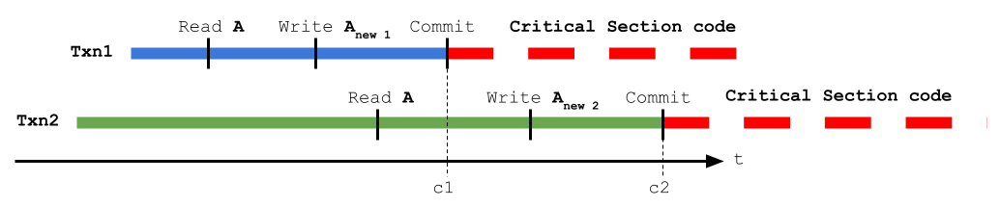

# Correctness disclaimer

The implementation at hand is not strictly correct and you should know about.

## TL;DR

The implementation is not correct and there is a non-zero chance that it will fail.
There are 2 major flaws you need to be aware of:
* UUID can collide and uniqueness is not guaranteed, it is extremely unlikely, but it is not zero.
  You can read about it on [Stackoverflow question 1155008](https://stackoverflow.com/questions/1155008/how-unique-is-uuid).
* The second, more likely than the first, is that your critical section may be executed multiple times.
  It is very unlikely but it is not zero. All the details, if you are concern, are below.

## The long commentary on the second issue

For this we need to dive deeper into the following details:
* What is a [transaction](https://cloud.google.com/spanner/docs/transactions) in [Cloud Spanner](https://cloud.google.com/spanner), specially [read-write transactions](https://cloud.google.com/spanner/docs/transactions#rw_transaction_properties).
* How we implemented the conditional upsert, we are talking about the method [spanner_mutex.SpannerMutex._set_mutex()](./code/src/py_spanner_mutex/spanner_mutex.py).

### Transactions in Cloud Spanner

A [read-write transactions](https://cloud.google.com/spanner/docs/transactions#rw_transaction_properties) will lock a row and guarantees that the whole block is either executed or rolled back.
This is great, but it is only so once all transactions are committed/tried to commit.
But we digress, let us put it plainly where the issue is: all clients are trying to lock a specific row at the same time.

#### I'm confused can you draw it?

Yes, let us show the failure scenario.

First, from Spanner perspective all is good.
Not for this use case though.
Let us go into the weeds of this particular scenario.

1. Transaction ``Txn2`` started first, so this is the one that will have the final word on Spanner.
1. Transaction ``Txn1`` is way faster than ``Txn2`` and commits successfully.
1. Client in ``Txn2`` starts executing the critical section after the commit.
1. Transaction ``Txn1`` is committed and Spanner rolls back ``Txn2`` (because ``Txn2`` started first).
1. Because ``Txn1`` commits successfully, client in ``Txn2`` starts executing the critical section as well.

This the case were multiple executions are possible.

#### Sounds bad, how likely it is?

This is a tricky question, let us break it down.
The main cause for such a scenario is when clients have different execution profiles.
By that we mean: it has different network capabilities (that would dilate the timings) and/or internal processing capabilities.
It also requires this to happen more-or-less simultaneously in a "spike".
One example is to have clients in different deployments, like native Google Cloud against on-premise.
Another example would be, inside Google Cloud but at completely different regions.
Meaning, deployments in the same region as the Spanner instance against deployments in very different regions, let us say ``us-east1`` (South Carolina) and ``asia-northeast1`` (Tokio).

To summarize the factors that increase the likelihood of multiple executions:
* Heterogeneous deployments: Google Cloud with another Cloud and/or on-prem.
* Heterogeneous regional networking: regional Spanner instance with access from different regions.
* Heterogeneous computing load: the code has heterogeneous latencies between acquiring the transaction and reaching the commit.
* Spikes: where the above is combine with more-or-less simultaneous/concurrent execution of the critical section.

To make maters worse, it is really hard to give an estimate on the probability.
It really depends on each case.

#### How can I minimize the issue?

This one is really easy to specify:
* Make sure all resources are close together, latency wise: deploy all clients on the same network region/environment.
  * Don't mix on-prem or other cloud provided with Google Cloud
  * Don't mix regions (zones within the same region usually have very low network latencies)
* Keep the needed processing between creating and committing the transaction really low.
  * The code itself is minimal, but this has todo with the host load that might create delays (several threads and high CPU utilization).

#### I'm still not sure

There is no way around, you will have to test it.
The suggestion is: create a stress test where you, at least, double the load of the expected maximum load.
Execute this test multiple times in a row.
If you don't see failures there this means that the likelihood is very low.

#### But it cannot fail for me

In this case you should **not** use this solution.
You will have to implement [Paxos](https://people.cs.rutgers.edu/~pxk/417/notes/paxos.html) and remember that you are constraint by the [CAP Theorem](https://en.wikipedia.org/wiki/CAP_theorem) no matter what.
Real hard constraints in this case usually means that your deployment model might not be the best.
In this case you might need to use [GKE](https://cloud.google.com/kubernetes-engine) or even multiple processes in the same host (for the extreme case).
